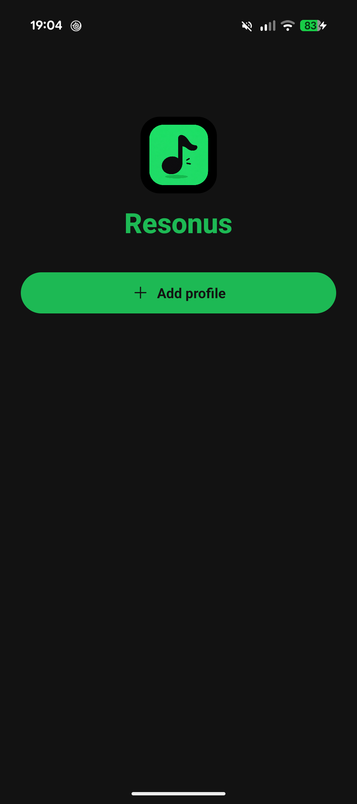
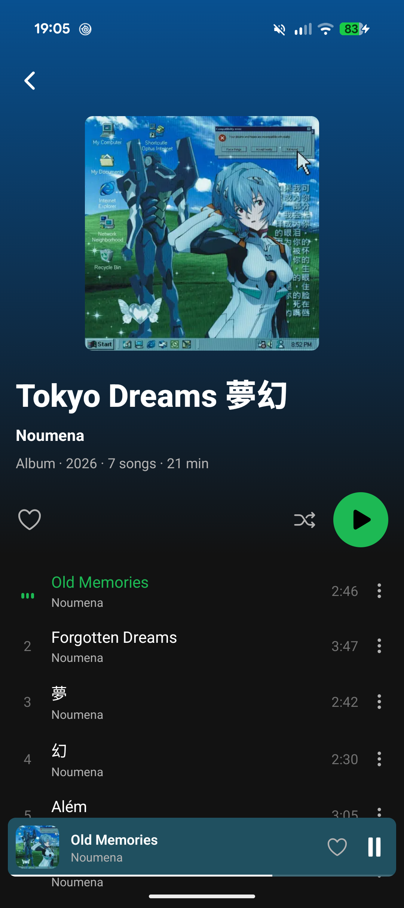
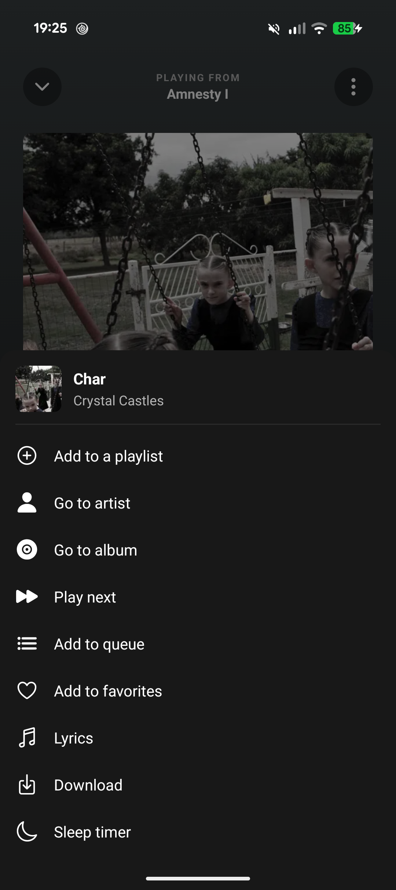
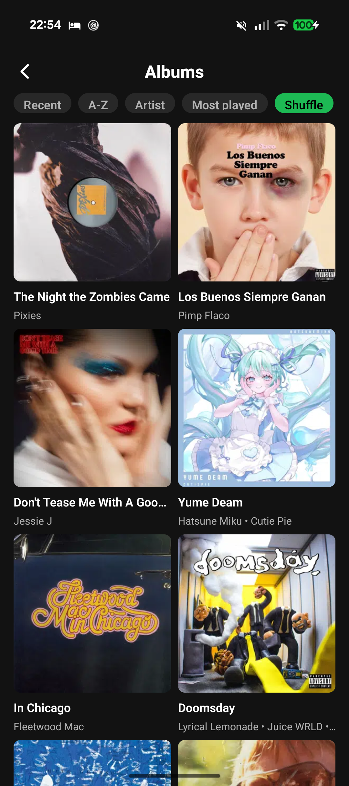
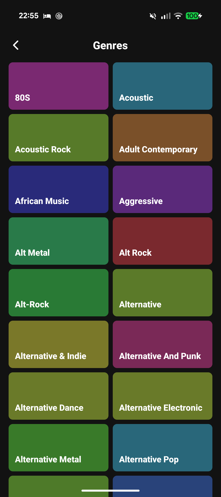
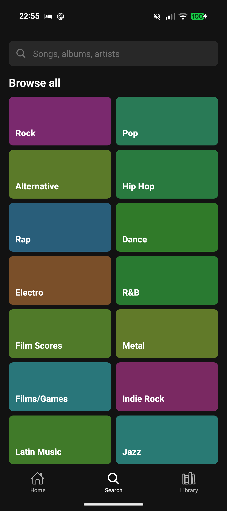
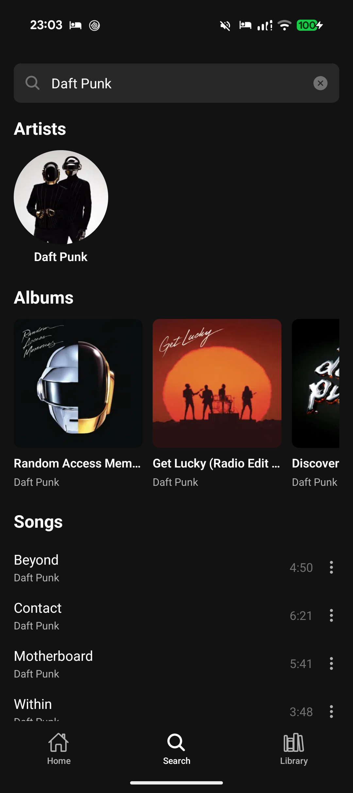

  

<h1 align="center">Resonus</h1>

  A clean Android music player for your self-hosted server — and your local files.

---

Resonus connects to **Navidrome** or any **OpenSubsonic**-compatible server (Subsonic API), or plays the **music stored on your device**. Browse, search, build queues and listen with background playback, lock-screen controls and **Android Auto**.

## Features

- **Navidrome / OpenSubsonic** — multi-profile login
- **Local mode** — play music offline from device or folder
- **Browse & search** — home, artists, albums, genres, playlists, favorites
- **Playback** — background playback, lock-screen controls, queue, shuffle, repeat, sleep timer, lyrics
- **Android Auto**
- **Queue sync across devices**

## Screenshots

  
  
  
  
  
  
  
  

## Roadmap

- [ ] Offline downloads (server → device)
- [ ] Equalizer & crossfade
- [ ] Local artwork in Android Auto
- [ ] Jellyfin support
- [ ] iOS support

## Translations

Resonus ships in **English and Spanish**, maintained in the repository
(`src/i18n/locales/`). English is the source language. Community translations
for more languages are planned as the project matures.

## License

[MIT](./LICENSE) © juananzzz
