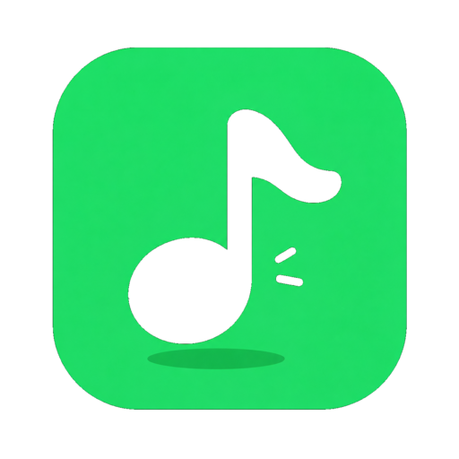
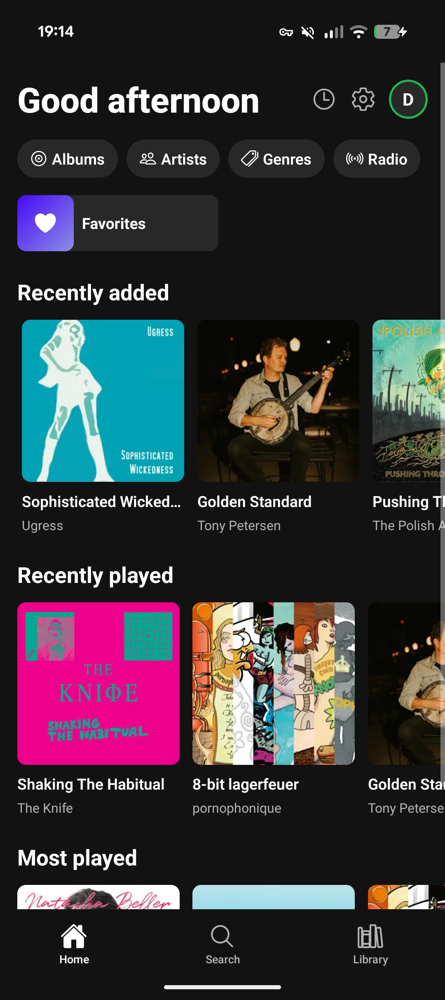
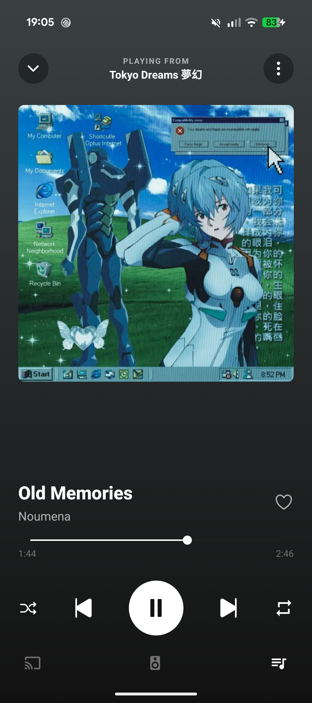

  

<h1 align="center">Resonus</h1>

  A clean Android music player for your self-hosted server — and your local files.

---

  
  

## Download

Get the latest APK from the [Releases](https://github.com/juananzzz/resonus/releases/latest) page and install it on your Android device.

## Screenshots

  
  
  
  

## Features

- **Navidrome / OpenSubsonic / Jellyfin / Ampache**: multi-profile login, multi-library support, plus several server addresses with automatic switching (experimental)
- **Local mode**: play music straight from your device or a folder, no server needed
- **Offline mode**: your favorites, playlists and albums stay browsable with no connection; downloaded songs play, the rest show grayed out, and it switches automatically when the server is unreachable
- **Downloads**: albums, playlists, an artist's whole discography or single songs, in original quality or transcoded
- **Synced lyrics**: karaoke view with tap-to-seek, full-screen mode, optional LRCLIB lookup
- **Internet radio**: browse and manage your stations
- **Cast to speakers**: UPnP/DLNA renderers
- **Playback**: crossfade, built-in equalizer, ReplayGain normalization, sleep timer, queue with undo, shuffle, repeat, background & lock-screen controls
- **Autoplay & mixes**: keep the music going with similar songs, or start a mix from any track
- **Organize**: multi-select (queue, playlist or download in batch), star ratings, pinned items, play history
- **Make it yours**: reorder and show/hide Home sections and explore chips, accent colors, app fonts, configurable swipe and ⋯ menu actions
- **Android Auto**
- **Queue sync across devices**
- **In 4 languages**: English, Spanish, German, Catalan

## Translations

Available in **English, Spanish, German, and Catalan**. More languages are
welcome via pull request — see [TRANSLATING.md](./TRANSLATING.md) for how to add
one, plus context for the trickier strings.

## Community

Join the [Discord server](https://discord.gg/hpDfszr8r) to share feedback,
report bugs, ask questions, or just follow along with development.

## Contributing

Contributions are welcome! See [CONTRIBUTING.md](./CONTRIBUTING.md) for how to
set up the project, run it on an emulator, and open a pull request.

## Support

Resonus is free and open source, built in my spare time. If you enjoy it and
want to help me keep working on it, you can buy me a coffee on
[Ko-fi](https://ko-fi.com/juananzzz).
